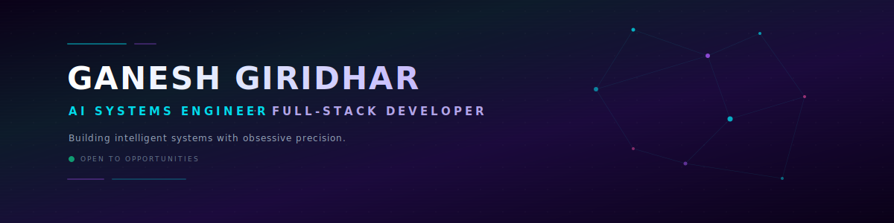

  

  
  
  
  

---

### 👋 Hi there, I'm Ganesh Giridhar

I am a Computer Science undergraduate at Amrita Vishwa Vidyapeetham (CGPA: 8.4) specializing in **Artificial Intelligence** and **Creative Full-Stack Web Development**. 

I engineer high-performance cognitive systems, custom RAG pipelines, and interactive 3D WebGL user interfaces. I build with obsessive attention to detail, adhering to **The Linear Paradigm**—a philosophy of structured, vector-driven engineering growth.

---

> [!IMPORTANT]
> 🤖 **Meet my AI Digital Twin!**
> I have trained a recruiter-facing "Digital Twin" chatbot powered by **Gemini 2.5 Flash** and a custom **RAG pipeline** (pre-embedded with 399 vector chunks). Talk to it live and explore my cinematic 3D portfolio at: **[brandofganesh.vercel.app](https://brandofganesh.vercel.app)**

---

### 🛠️ Technical Arsenal

| Category | Technologies |
| :--- | :--- |
| **Languages** |     |
| **AI & Intelligent Systems** |     |
| **3D & Creative Frontend** |      |
| **Backend & Databases** |      |
| **Mobile & Dev Tools** |     |

---

### 🚀 Projects Portfolio

#### 🏆 Hackathon Winners & Top Honors

*   🌾 **[RiceAgent](https://github.com/Ganesh2006646/RICE_APP.git)** (1st Place Winner) | *Flutter · SQLite/Hive · Offline-First*
    *   **How it works**: Uses a robust local caching architecture with SQLite and Hive to allow agricultural data collection in low-connectivity fields. Implements automatic background synchronization protocols to push cached records to the cloud when internet connectivity resumes.
*   🎯 **[Flip Wars](https://github.com/Ganesh2006646/FLIP.git)** (2nd Place Winner) | *Java · JavaFX · Game Theory*
    *   **How it works**: A tactical multiplayer board game engine. Optimizes AI decision-making loops using Minimax search algorithms paired with Alpha-Beta pruning and transposition tables (memoization) to cut opponent move calculation latency.
*   🏗️ **[ExecuCode](https://github.com/Ganesh2006646/meta---hackathon.git)** (3rd Place — Meta OpenEnv Hackathon) | *FastAPI · Gemini SDK · Python · RL Environments*
    *   **How it works**: Implements a secure sandbox execution environment that parses and grades user-submitted Python code. It automatically evaluates code syntax trees (ASTs), executes them safely, and uses a reinforcement learning loop powered by Gemini to provide detailed, actionable code improvement suggestions.
*   🔒 **[SatyaRaksha — सत्यरक्षा](https://github.com/MANIDEEP2407-SYS/codorra.git)** (Codorra 2026 Hackathon) | *React · Node.js · Web Crypto · Shamir's Secret Sharing*
    *   **How it works**: A zero-knowledge decentralized dead man's switch to protect whistleblowers. Leverages AES-256-GCM encryption and breaks cryptographic keys into shards using Shamir's 2-of-3 secret sharing. Triggers automated document release if encrypted heartbeats are not checked in periodically.
*   🛡️ **[Spectra-Shield](https://github.com/Ganesh2006646/pathway_hackathon.git)** (Synaptics AI Hackathon) | *Pathway · LiteLLM · Gemini · Python*
    *   **How it works**: A real-time, streaming security auditing framework. Parses active document intake pipelines to check for structural anomalies, data leaks, and prompt injection attempts before documents hit centralized vector databases.

#### 🤖 Artificial Intelligence & Cognitive Engines

*   💬 **[Personal RAG Chatbot Engine](https://github.com/Ganesh2006646/Personal-Rag-LLM-Chatbot.git)** | *Gemini 2.5 Flash · RAG · Serverless · SSE*
    *   **How it works**: Powers the recruiter-facing AI chatbot on my portfolio site. Built on a serverless Node.js backend executing vector search over 399 personal biography data chunks using Gemini embeddings. Answers visitor questions in real time with Server-Sent Events (SSE) streaming and role-aware conversational memory.
*   ⚖️ **[Dispute De-Escalator](https://github.com/Ganesh2006646/gemini--3-hackathon.git)** (Google AI Studio Product) | *Gemini Models · Agentic NLP*
    *   **How it works**: Designed to reduce judicial backlogs by resolving civil disputes online. Utilizes agentic NLP chains to extract facts, isolate pain points, structure emotional statements, and output balanced out-of-court settlement terms.

#### 💼 Full-Stack & Industrial Applications

*   🍽️ **[Mess Management System](https://github.com/Ganesh2006646/food-management-system-.git)** | *Node.js · Express · PostgreSQL*
    *   **How it works**: Streamlines institutional dining and kitchen logistics. Integrates REST APIs with an ACID-compliant PostgreSQL database to authorize student meal plans, track dining check-ins in real time, and monitor pantry inventory consumption.
*   📁 **[ProjectHub](https://github.com/Ganesh2006646/codsoft_task2.git)** (CodSoft Internship) | *React · Node.js · MongoDB · Express*
    *   **How it works**: A collaborative work environment featuring Kanban boards, role-based workspaces (Admin, Head, User), and secure JWT sessions.
*   🛒 **[ShopEase](https://github.com/Ganesh2006646/codsoft_task1.git)** (CodSoft Internship) | *React · Node.js · MongoDB · Express · Tailwind CSS*
    *   **How it works**: A MERN e-commerce application with secure token authorization, cart reservation logic, coupon systems, and order trackers.
*   🎬 **[Tour Management Portal](https://github.com/Ganesh2006646/tourwebsite.git)** | *HTML5 · CSS3 · JavaScript*
    *   **How it works**: A highly responsive, multi-page frontend travel agency application incorporating client-side routing, modular UI designs, and travel search tools.

---

### 📊 GitHub Analytics

  
  

  

---

### 🔮 The Linear Paradigm

> *"Growth is not a random walk; it is a vector. By aligning every action with a singular direction, we construct a linear path to exceptional engineering."*

   
  <strong>"Built with obsessive attention to detail. Powered by The Linear Paradigm."</strong>
    
  Designed with meticulous precision. Powered by Gemini.

